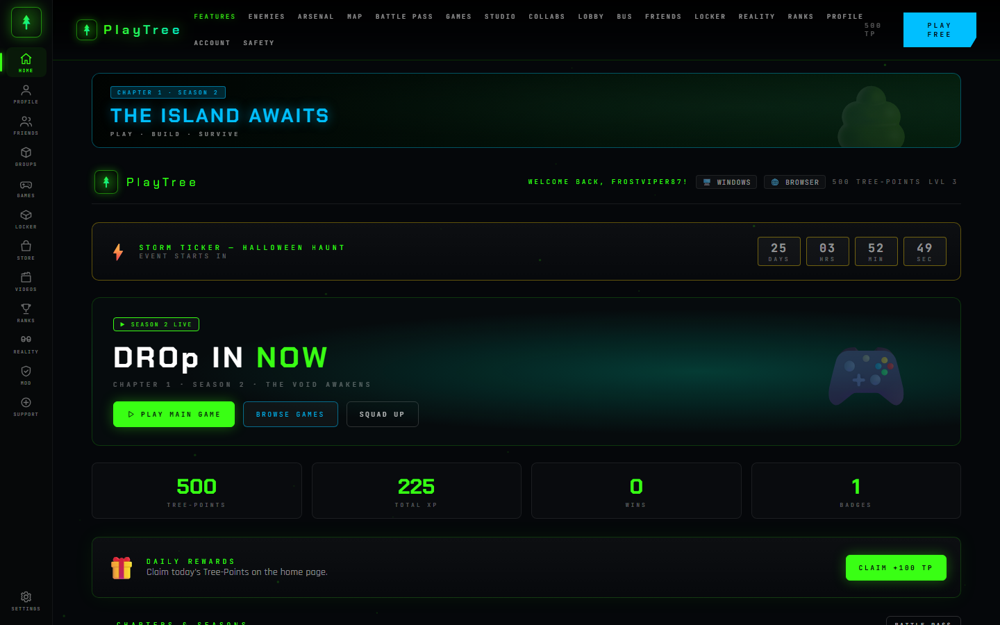
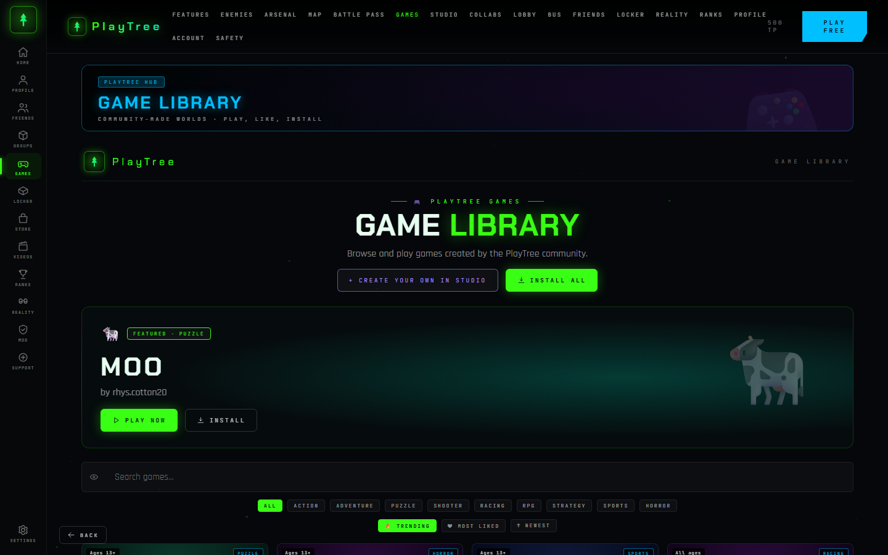
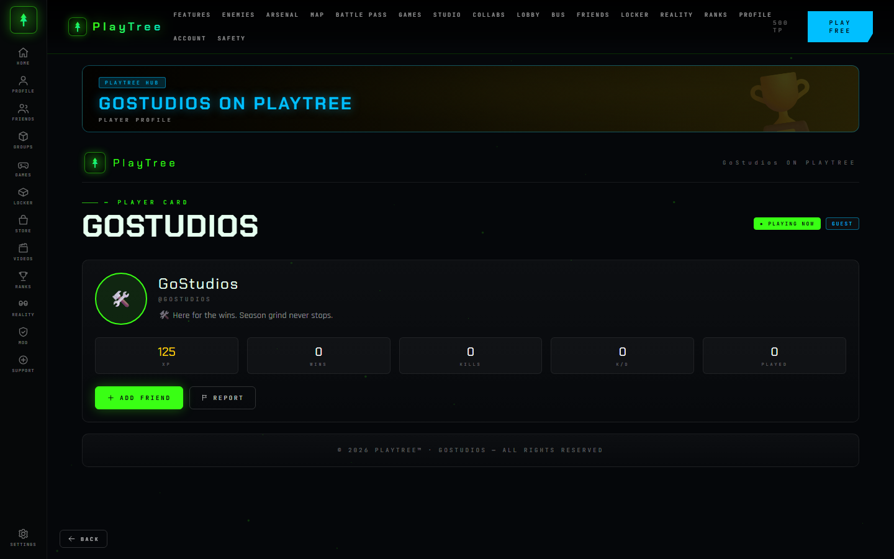
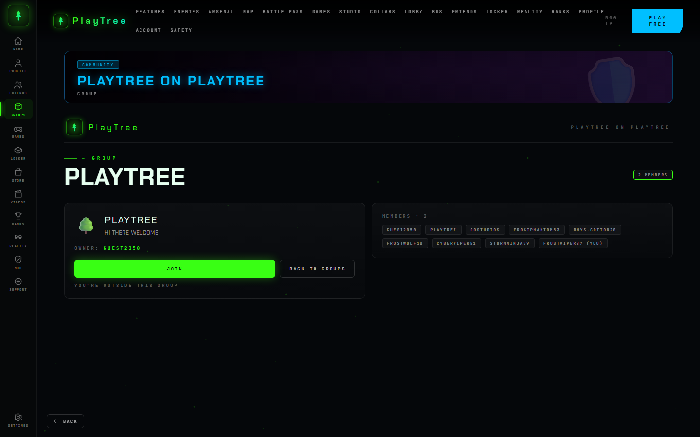
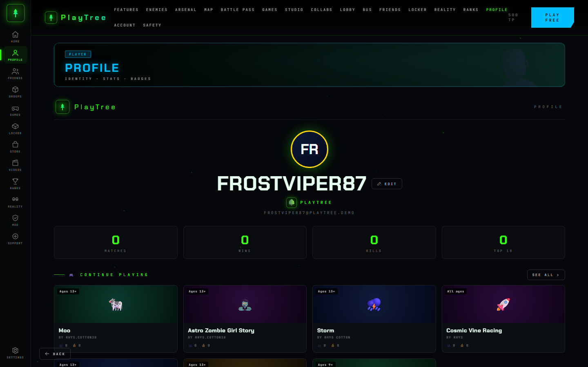
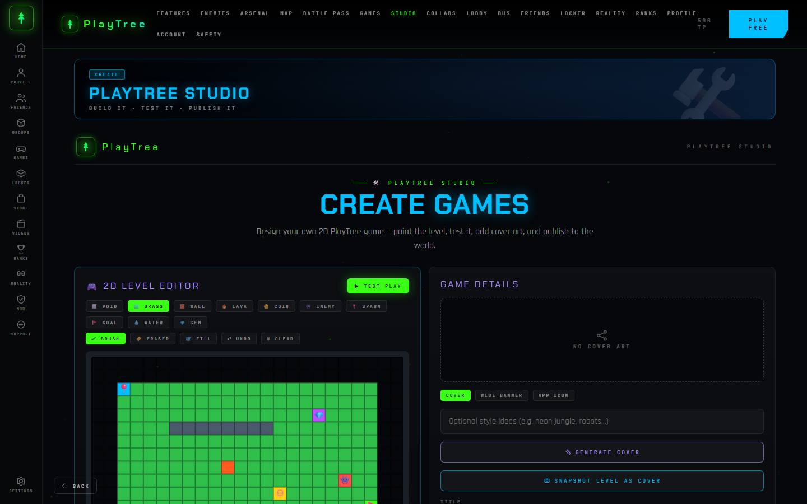
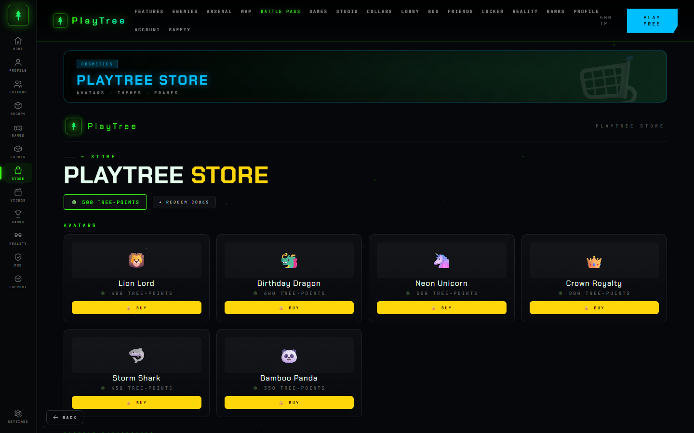
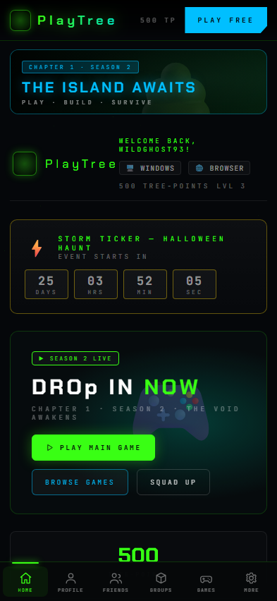
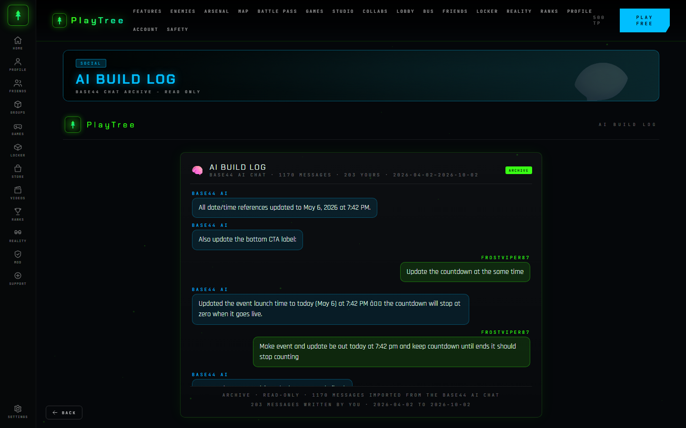
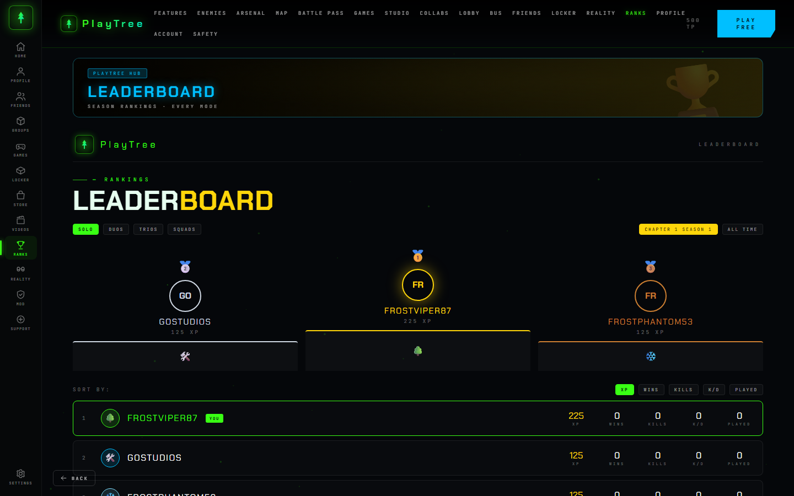

# PlayTree™

**The PlayTree gaming universe — one app for your profile, games, locker, store, and community.**

PlayTree is a dark neon-themed gaming hub where you create an identity, play arcade games, build your own levels in Studio, earn Tree-Points, and climb the leaderboard. Ships as a web app, an Android app, and a Windows desktop app from a single codebase.



## Features

- **Gate** — username entry + scan intro that creates your local player profile
- **Home** — hero banner, daily rewards, chapters & seasons, quick stats
- **Games** — community game library with search, genre filters, likes and installs
- **Arcade** — five playable canvas game engines: catcher, survivor, shooter, racer, and maze
- **PlayTree Studio** — 2D level editor with brush/eraser/fill tools, Test Play, cover-art generator, and publishing to the library
- **Locker & Store** — avatars, themes, and frames bought with Tree-Points
- **Profile** — identity, stats, badges, continue-playing row
- **Social** — friends, groups, chat, videos, public player profiles (`/player/:name`), group pages (`/groups/:id`), and a global leaderboard
- **AI Build Log** — your complete Base44 builder AI chat archive imported via API (1,170 messages, 203 written by you) at `/chat` (live chat removed)
- **Offline mode** — custom PlayTree "YOU'RE OFFLINE" screen with **ENTER OFFLINE MODE** when the network drops
- **Loading screens** — spinning PlayTree logo every time you launch a game
- **Storm ticker** — event countdown on home that stops at zero when the event goes live
- **Welcome back** — home greeting with platform chips (Windows / Android / iOS / macOS / Linux / Browser)
- **PWA install** — manifest + service worker + **ADD TO DESKTOP** button; redeem code `PLAYTREE400` = 400 Tree-Points
- **Reality / Collaborations** — seasonal events and brand collab drops
- **Account & Safety** — settings, parental controls, moderation, redeem codes, and a one-click link to the GoStudios Support dashboard
- **Offline-first** — everything persists to `localStorage`, no server required

## Screenshots

| Home | Games |
| --- | --- |
|  |  |

| Player profile | Group page |
| --- | --- |
|  |  |

| Profile | Studio |
| --- | --- |
|  |  |

| Store | Mobile |
| --- | --- |
|  |  |

| AI Build Log (chat archive) | Leaderboard |
| --- | --- |
|  |  |

## Download

Grab the latest build from the [Releases page](../../releases):

| Artifact | Platform | Notes |
| --- | --- | --- |
| `PlayTree-1.0.0-release.apk` | Android 13+ | Signed release APK |
| `PlayTree-1.0.0-debug.apk` | Android 13+ | Debug build, installs alongside release |
| `PlayTree-Setup-1.0.0.exe` | Windows 10/11 | NSIS installer (Start Menu + Desktop shortcut) |
| `PlayTree-Portable-1.0.0.exe` | Windows 10/11 | Single-file portable app |

> All four artifacts are digitally signed by GoStudios. The Android APK uses
> the release keystore; the Windows EXEs carry an Authenticode signature from
> the GoStudios certificate. Because that certificate is not issued by a public
> CA, SmartScreen may still warn on first run — choose *More info → Run anyway*.

## Quick start (web)

```bash
npm install
npm run dev        # http://localhost:5180
npm run build      # production build → dist/
```

## Tests

```bash
npx playwright install chromium   # first run only
npm run test:e2e                  # builds dist/ then runs tests/e2e.cjs
```

36 end-to-end checks covering the gate → home flow, claim/redeem, hero game
canvas, studio editor publish, store purchases, locker, friends/chat, battle
bus, party, persistence across reload, settings, and the mobile bottom-nav
layout. Screenshots land in `tests/results/`. Exits non-zero on any failure or
console/page error.

## Build the apps

### Android (APK)

Requires JDK 17+ and the Android SDK (34).

```bash
npm run cap:sync          # vite build + sync web assets into android/
cd android
gradlew.bat assembleDebug # → android/app/build/outputs/apk/debug/app-debug.apk
gradlew.bat assembleRelease
```

- `minSdkVersion = 33` (Android 13) in `android/variables.gradle`
- Release signing is read from `build/keystore.properties` (gitignored) — copy the example values and point `storeFile` at your own keystore
- Splash screen and launcher icons live in `android/app/src/main/res/` (regenerate from `build/icon.svg`)

### Windows (EXE)

```bash
npm run dist:win          # → release/PlayTree Setup 1.0.0.exe + PlayTree 1.0.0.exe
```

Electron loads `dist/index.html` directly; packaging config is the `build` field
in `package.json`. `dist:win` runs `scripts/dist-win.cjs`, which loads the
Authenticode certificate path and password from `build/keystore.properties`
(gitignored) and passes them to electron-builder as `CSC_LINK` /
`CSC_KEY_PASSWORD`, so no secrets live in the public repo.

## Project layout

```
src/
  App.jsx            route table + auth gate
  main.jsx           entry
  store.jsx          app context + localStorage persistence (pt_state_v1)
  data.js            seed content: games, items, badges, themes
  layout.jsx         icon rail, top nav, page banner, stars
  icons.jsx          inline SVG icon set
  games.jsx          canvas game engines + game modal
  styles.css         full design system
  pages/
    Home.jsx         gate, scan, home page
    Core.jsx         games, lobby, battle bus
    Social.jsx       profile, locker, store, leaderboard, friends, groups, videos
    Studio.jsx       2D level editor + publishing
    Misc.jsx         settings, reality, collabs, account, safety, legal, chat
electron/main.cjs    Electron main process
android/             Capacitor Android project
build/               icons (svg/png/ico)
```

## Tech

React 18 · Vite 5 · React Router 6 · Capacitor 6 · Electron 33 · electron-builder 25

## License, copyright & trademark

- **License:** proprietary — see [LICENSE](LICENSE). Personal, non-commercial
  use only; no redistribution. `package.json` declares `UNLICENSED`.
- **Copyright:** © 2026 GoStudios. All rights reserved. Copyright notices also
  ship inside the app footer and the in-app Terms / Privacy pages.
- **Trademark:** PlayTree™, the PlayTree logo and app icons are trademarks of
  GoStudios — see [TRADEMARKS.md](TRADEMARKS.md) for usage guidelines.
- **Signing:** APKs are signed with the GoStudios release keystore; Windows
  EXEs are Authenticode-signed during `npm run dist:win` (credentials stay in
  gitignored `build/keystore.properties`).
